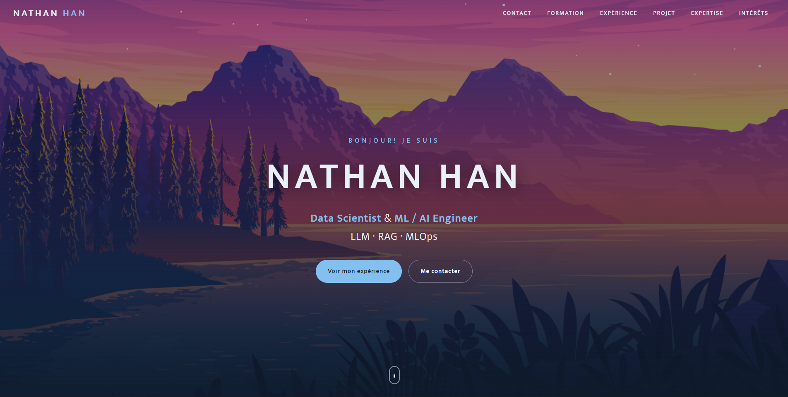

# 🌐 Portfolio — Nathan HAN

> **Data Scientist & ML / NLP Engineer** (LLM · RAG · MLOps)

Portfolio personnel responsive présentant mon parcours, mes expériences et mes compétences en Data Science et Intelligence Artificielle.

<p align="center">
  <a href="#-aperçu">Aperçu</a> ·
  <a href="#-fonctionnalités">Fonctionnalités</a> ·
  <a href="#-technologies">Technologies</a> ·
  <a href="#-lancer-en-local">Lancer en local</a>
</p>

---

## 🔗 Site en ligne

👉 **[Voir le portfolio en ligne](https://nathanhan.netlify.app/)**


## 📸 Aperçu



## ✨ Fonctionnalités

- 🎯 **Design responsive** — adapté mobile, tablette et desktop
- 🍔 **Menu de navigation mobile** avec ouverture/fermeture animée
- 📌 **Barre de navigation sticky** qui change d'état au défilement
- 🎬 **Animations au scroll** (apparition des sections quand elles entrent dans le viewport)
- ♿ **Accessibilité** — respect de `prefers-reduced-motion` (animations désactivées si l'utilisateur le souhaite)

## 🧭 Sections

| Section | Contenu |
|--------|---------|
| **Contact** | Présentation et coordonnées |
| **Formation** | Lycée Montaigne · UPMC · Sorbonne Université · Epitech |
| **Expérience** | Safran Landing Systems · Whispr (messagerie sécurisée) |
| **Expertise** | Compétences techniques |
| **Centres d'intérêt** | À titre personnel |

## 🛠️ Technologies


- **HTML5** sémantique
- **CSS3** (Flexbox, animations, design responsive)
- **JavaScript** vanilla (IntersectionObserver, pas de dépendances)
- Police **Mukta** via Google Fonts

## 🚀 Lancer en local

Aucune installation nécessaire — c'est un site statique.

```bash
# Cloner le dépôt
git clone https://github.com/scarlanathan/Portfolio.git
cd Portfolio

# Ouvrir la page d'accueil
# (double-clic sur resume.html, ou via un serveur local :)
python -m http.server 8000
# puis ouvrir http://localhost:8000/resume.html
```

## 🌍 Déploiement

Le projet est prêt pour **Netlify** (voir `netlify.toml`) :

1. Connecte-toi sur [netlify.com](https://netlify.com) avec ton compte GitHub
2. **Add new site → Import an existing project → GitHub → `Portfolio`**
3. Laisse les réglages par défaut puis **Deploy**

Le fichier `netlify.toml` publie la racine et redirige tout le trafic vers `resume.html`.

## 📂 Structure du projet

```
Portfolio/
├── resume.html        # Page principale du portfolio
├── css/
│   └── style.css      # Styles et responsive
├── js/
│   └── main.js        # Interactions (nav, animations au scroll)
├── image/             # Visuels (formation, fonds, icônes)
├── netlify.toml       # Configuration de déploiement
└── README.md
```

## 📫 Contact

- **GitHub** — [@scarlanathan](https://github.com/scarlanathan)

---

<p align="center">
  ⭐ Si ce portfolio te plaît, n'hésite pas à laisser une étoile !
</p>
